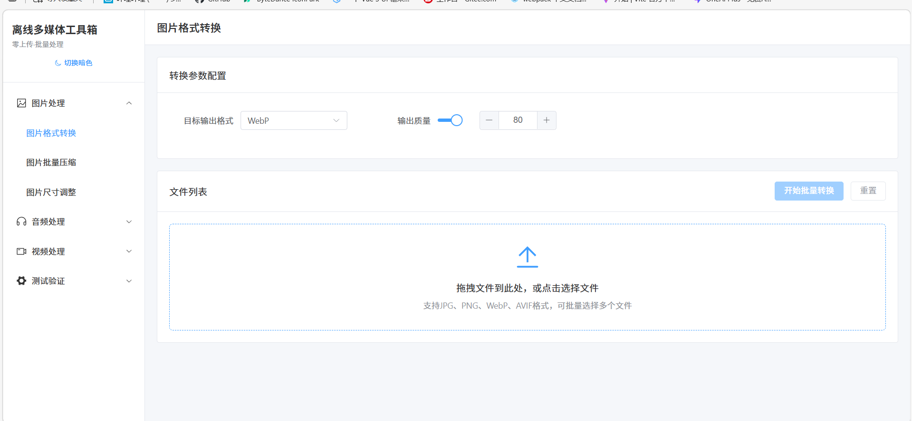
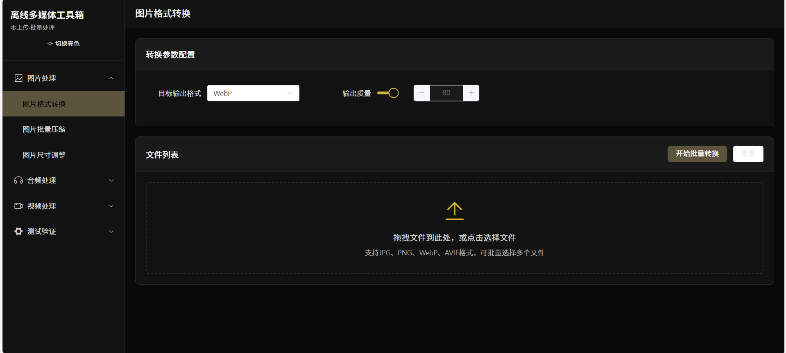

# 基于wasm的离线多媒体批量处理工具
一个纯前端实现的离线多媒体批量处理工具，基于Vue3 + WebAssembly + Web Worker开发，所有处理都在浏览器本地完成，无需上传文件到服务器，完全保护用户隐私，支持图片、音频、视频三大类媒体的批量处理。

//主要功能：
图片格式批量转换（JPG/PNG/WebP/AVIF等格式互转）
图片批量压缩（平衡画质与体积）
图片尺寸批量调整（等比缩放、固定尺寸、限制最大宽高）

//音频处理
音频格式批量转换（MP3/WAV/FLAC/AAC等格式互转）
音频片段批量裁剪
音频音量批量调整
从视频中提取音频文件

//视频处理
视频格式批量转换（MP4/MOV/AVI等格式互转）
视频批量压缩（大幅减小文件体积，平衡画质）
视频片段批量裁剪
视频转GIF动图（高质量画质优化）
从视频中提取封面图/音频文件

## 工具截图

